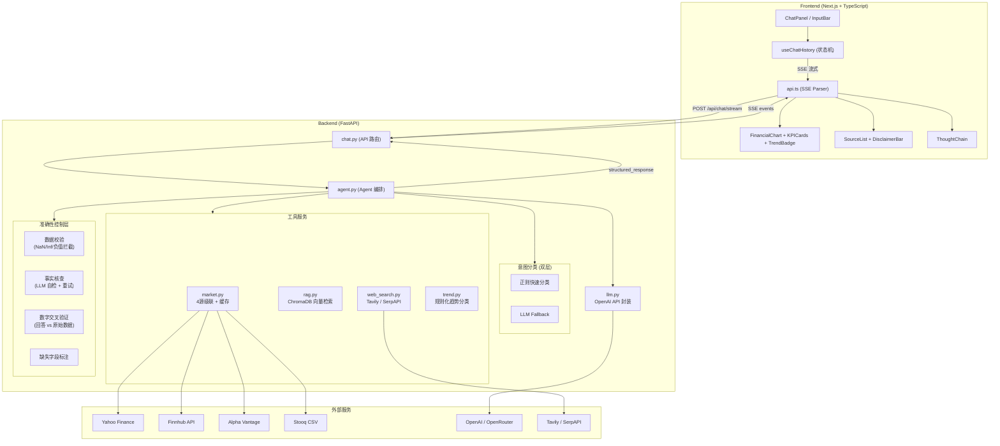

# FinAI — 基于大模型的全栈金融资产问答系统

一个结合实时行情 API、RAG 知识检索和大语言模型的金融问答系统。支持资产价格查询、涨跌原因分析、金融知识问答，并在架构层面系统性控制回答准确性。

## 目录

- [系统架构](#系统架构)
- [核心能力](#核心能力)
- [技术选型](#技术选型)
- [路由设计](#路由设计)
- [Prompt 设计思路](#prompt-设计思路)
- [准确性控制](#准确性控制--hallucination-mitigation)
- [数据来源](#数据来源)
- [项目结构](#项目结构)
- [本地运行](#本地运行)
- [Docker 部署](#docker-部署)
- [优化与扩展思考](#优化与扩展思考)

---

## 系统架构



## 核心能力

### 1. 资产价格与涨跌分析

- 获取实时/近期价格数据（4 层数据源级联，任一成功即返回）
- 计算 7 日、30 日涨跌幅和区间高低点
- **规则化趋势分类**：基于涨跌幅 + 振幅 + 线性斜率，不依赖 LLM 判断
- 返回结构化 `data_summary` + `trend_summary`，客观数据与分析严格分离

### 2. 涨跌原因分析

- 抽取资产和日期引用（支持"1月15日""上周""最近"等表达）
- 获取对应窗口的行情数据
- 搜索相关新闻/事件证据（Tavily / SerpAPI）
- LLM 基于行情 + 证据做归因分析，使用谨慎措辞
- 明确区分：观测数据 / 可能原因 / 证据来源 / 风险说明

### 3. 金融知识问答（RAG）

- ChromaDB 向量数据库 + OpenAI Embedding
- 文档分块（500 字符/块，80 字符重叠，按 Markdown 层级分割）
- 相似度搜索，低于 0.3 阈值自动过滤
- Web 搜索兜底（RAG 未命中时）
- 事实核查：LLM 自检回答中的数值是否与参考资料一致，不通过则重试

### 4. 多轮对话

- 保留最近 6 条消息作为上下文
- Ticker 指代回溯（如先问"阿里巴巴股价"，再问"它为什么跌"能自动关联）

### 5. 流式输出与思维链

- SSE 实时推送：thought → token → chart → meta → done
- 思维链可视化：展示完整的 Agent 决策过程
- 前端状态机管理：idle → sending → thinking → idle/error

---

## 技术选型

| 层级 | 技术 | 选型理由 |
|------|------|----------|
| **前端框架** | Next.js 14 + TypeScript | App Router、SSR/CSR 灵活、类型安全 |
| **UI 样式** | Tailwind CSS | 原子化 CSS、快速开发、深色主题 |
| **图表** | Recharts | React 原生、轻量、AreaChart 适合金融走势 |
| **状态管理** | useReducer 状态机 | 严格状态转换、防止并发不一致 |
| **后端框架** | FastAPI (Python) | 异步高性能、自动 OpenAPI 文档、SSE 原生支持 |
| **行情数据** | yfinance + Finnhub + Alpha Vantage + Stooq | 4 源级联、免费、覆盖面广 |
| **向量数据库** | ChromaDB | 本地嵌入、零基础设施依赖 |
| **Embedding** | text-embedding-3-small | 高质量、低成本、支持 OpenRouter 代理 |
| **LLM** | GPT-4o-mini / DeepSeek | 性价比高、支持 OpenRouter 统一接入 |
| **Web 搜索** | Tavily / SerpAPI | RAG 兜底 + 事件分析证据来源 |
| **部署** | Docker Compose | 前后端一键编排、含健康检查 |

---

## 路由设计

系统采用 **4 类意图路由**，每种路由有明确的输入、执行链路和输出格式：

```
用户问题
    │
    ├─ Ticker 识别（映射表 + 历史回溯）
    │
    ├─ 意图分类（正则优先 → LLM fallback）
    │
    ├─→ market_data      价格/走势/涨跌幅
    │     行情API → 数据校验 → LLM解读 → 数字验证 → structured_response
    │
    ├─→ market_reasoning  涨跌原因分析
    │     日期提取 → 行情API → Web搜索证据 → LLM归因 → structured_response
    │
    ├─→ knowledge_rag     金融知识问答
    │     RAG检索 → [Web搜索兜底] → LLM生成 → 事实核查 → structured_response
    │
    └─→ general           通用问答
          LLM 直接回答
```

### 意图分类策略

**第一层：正则快速分类（零成本，零延迟）**

| 优先级 | 类别 | 匹配关键词 |
|--------|------|-----------|
| 1 | `market_reasoning` | 为什么、为何、原因、大涨.*原因、why、reason |
| 2 | `market_data` | 股价、走势、涨跌、多少钱、price、stock |
| 3 | `knowledge_rag` | 什么是、解释、定义、what is、explain |

> reasoning 优先于 market_data，因为"为什么大涨"同时包含行情关键词。

**第二层：LLM Fallback 分类**

正则未命中时调用 LLM（temperature=0, max_tokens=10），返回结果由 `_normalize_intent()` 归一化到 4 类，兼容旧标签。

### 结构化回答

所有路由返回统一的 `structured_response`，由后端程序组装（非 LLM 生成），保证准确性：

```json
{
  "response_type": "market_data",
  "data_summary": {
    "price": 178.25,
    "change_7d": 3.52,
    "high_7d": 182.0,
    "low_7d": 170.1,
    "data_source": "yahoo",
    "timestamp": "2025-01-15T10:30:00"
  },
  "trend_summary": {
    "label": "uptrend",
    "label_cn": "上涨",
    "confidence": "high",
    "rationale": "7日涨幅 +3.52%，价格斜率向上"
  },
  "sources": [{"title": "行情数据", "source": "yahoo"}],
  "disclaimer": "以上数据来自第三方行情接口...不构成投资建议。"
}
```

---

## Prompt 设计思路

### 1. 行情数据 Prompt（market_data）

采用**强制三段结构**：

```
📊 客观数据 — 仅列出 API 返回的真实数字，标注来源和时间
📈 趋势总结 — 明确给出上涨/下跌/震荡判断及依据
💡 补充说明 — 缺失数据明确告知，不编造
```

核心约束：`所有数字必须来自提供的 market_data，不得自行生成价格数据`

### 2. 原因分析 Prompt（market_reasoning）

采用**强制四段结构 + 证据约束**：

```
📉 市场表现观察 — 实际涨跌数据（来自 API）
🔍 可能原因分析 — 基于新闻/事件归因，谨慎措辞
📑 证据来源     — 列出引用的新闻标题和出处
⚠️ 风险说明     — 不确定性声明 + 不构成投资建议
```

核心约束：`不臆造、区分事实与分析、证据不足时明确说明`

### 3. 知识问答 Prompt（knowledge_rag）

采用**四段渐进结构**：

```
📌 核心定义/结论 — 直接回答
📖 展开解释     — 分点阐述
💡 示例（如适用）— 具体例子辅助理解
📑 来源说明     — 标注信息来源
```

核心约束：`优先使用参考资料，无检索结果时标注"基于模型通用知识"`

### 4. 事实核查 Prompt

独立的核查 Agent，输出 JSON `{passed, issues}`，核查 LLM 回答中的数值是否与参考资料一致。不通过则注入反馈重试一次。

---

## 准确性控制 / Hallucination Mitigation

系统实现了**三层准确性防线**，整合在独立的 `grounding.py` 模块中：

```
┌─────────────────────────────────────────────────────────────┐
│ 第一层：数据源隔离                                          │
│                                                             │
│  market_data     → 数据只来自行情 API，LLM 只解释不编数据   │
│  market_reasoning→ 行情 API + Web 搜索证据，LLM 做归因     │
│  knowledge_rag   → RAG 向量检索 + Web 搜索，LLM 做整合     │
│  general         → LLM 通用知识（不涉及实时数据）           │
├─────────────────────────────────────────────────────────────┤
│ 第二层：检索过滤                                            │
│                                                             │
│  • RAG 相似度阈值 ≥ 0.3（低于丢弃）                        │
│  • 行情数据 NaN/Inf/负值拦截（market.py 数据清洗）          │
│  • 价格缓存 TTL 60s / 历史缓存 1h                           │
│  • 降级缓存显式标注 stale + age                             │
├─────────────────────────────────────────────────────────────┤
│ 第三层：输出约束                                            │
│                                                             │
│  • Prompt 约束："所有数字必须来自 market_data"               │
│  • 事实核查：LLM 自检回答 vs RAG 来源（不通过则重试）       │
│  • 数字交叉验证：回答中的数字 vs market_data（无需额外LLM）  │
│  • 缺失字段显式标注：注入"无法获取"提示到 Prompt            │
│  • structured_response 的 data_summary 由程序组装            │
│  • 原因分析强制使用谨慎措辞："可能原因""或与…有关"         │
└─────────────────────────────────────────────────────────────┘
```

### 趋势分类规则（trend.py）

趋势判断使用**纯规则模块**，不依赖 LLM：

| 指标 | 来源 | 作用 |
|------|------|------|
| 涨跌幅 | API 计算 | 主判据：> +2% 上涨，< -2% 下跌 |
| 振幅 | (high-low)/low | 窄幅涨跌 + 高振幅 → 震荡 |
| 斜率 | 最小二乘法 | ±2% 内用斜率区分微趋势 |

输出带 `confidence` 分级（high / medium / low），前端据此展示不同样式。

---

## 数据来源

| 数据类型 | 来源 | 刷新策略 | 备注 |
|----------|------|----------|------|
| 实时股价 | yfinance → Finnhub → Alpha Vantage → Stooq | 缓存 60s | 4 源级联，任一成功即返回 |
| 历史行情 | yfinance → Stooq | 缓存 1h | 7 日 / 30 日窗口 |
| 金融知识 | 本地 .md/.txt → ChromaDB | 启动时加载 | 500 字符/块，80 重叠 |
| 新闻证据 | Tavily / SerpAPI | 实时搜索 | 用于原因分析链路 |
| LLM | OpenAI / OpenRouter | 按需调用 | 支持 GPT-4o-mini / DeepSeek |

---

## 项目结构

```
fin-ai-agent/
├── backend/
│   ├── app/
│   │   ├── main.py                  # FastAPI 入口 + 生命周期
│   │   ├── routers/
│   │   │   └── chat.py              # API 路由（chat + stream）
│   │   ├── services/
│   │   │   ├── agent.py             # Agent 编排：4类路由 + 思考链 + 审计日志
│   │   │   ├── market.py            # 行情服务：4源级联 + 缓存 + 重试 + 清洗
│   │   │   ├── rag.py               # RAG 检索：ChromaDB + Embedding
│   │   │   ├── llm.py               # LLM 封装：流式/非流式 + 意图分类
│   │   │   ├── web_search.py        # Web 搜索：Tavily / SerpAPI
│   │   │   ├── grounding.py         # 准确性控制层：事实核查 + 数据校验
│   │   │   ├── trend.py             # 趋势分析：规则化分类（涨跌幅+振幅+斜率）
│   │   │   └── metrics.py           # 监控指标收集器
│   │   ├── prompts/
│   │   │   └── templates.py         # Prompt 模板（行情/原因分析/RAG/核查/分类）
│   │   ├── models/
│   │   │   └── schemas.py           # Pydantic 模型 + StructuredResponse
│   │   └── utils/
│   │       ├── ticker_map.py        # 公司名/别名 → Ticker 映射（40+）
│   │       ├── date_extract.py      # 日期提取 + 搜索 query 构造
│   │       └── sanitize.py          # 输入安全：长度限制 + 注入检测
│   ├── data/                        # 金融知识库文档（.md / .txt）
│   └── requirements.txt
├── frontend/
│   ├── src/
│   │   ├── app/page.tsx             # 主页面：Header + Messages + InputBar
│   │   ├── components/
│   │   │   ├── MessageBubble.tsx     # 消息气泡：Markdown + 结构化卡片
│   │   │   ├── FinancialChart.tsx    # 走势图：Recharts AreaChart
│   │   │   ├── KPICards.tsx          # KPI 卡片：价格/涨跌/PE/市值
│   │   │   ├── TrendBadge.tsx        # 趋势标签：方向 + 置信度 + 依据
│   │   │   ├── ThoughtChain.tsx      # 思维链：可折叠推理步骤
│   │   │   ├── SourceList.tsx        # 来源列表：行情API/Web搜索/知识库
│   │   │   ├── DisclaimerBar.tsx     # 风险声明条
│   │   │   ├── ExampleQuestions.tsx   # 示例问题卡片
│   │   │   └── InputBar.tsx          # 输入框
│   │   ├── lib/
│   │   │   ├── api.ts               # API 客户端 + SSE 解析 + 超时保护
│   │   │   ├── useChatHistory.ts     # 状态机 Hook + localStorage 持久化
│   │   │   ├── useServerStatus.ts    # 服务健康检查（15s 轮询）
│   │   │   └── useColorScheme.ts     # 涨跌配色切换（中国/美国）
│   │   └── types/
│   │       └── chat.ts              # TypeScript 类型（含 StructuredResponse）
│   └── package.json
├── .env.example                     # 环境变量模板
├── docker-compose.yml               # Docker 编排
└── README.md
```

---

## 本地运行

### 前置条件

- Python 3.10+
- Node.js 18+
- OpenAI API Key（或 OpenRouter Key）

### 1. 克隆 & 配置

```bash
git clone <repo-url>
cd fin-ai-agent
cp .env.example .env
# 编辑 .env，填入 API Key
```

`.env` 关键配置：

```bash
# LLM（二选一）
# 方案 A：OpenAI 直连
OPENAI_API_KEY=sk-xxx
OPENAI_BASE_URL=https://api.openai.com/v1
OPENAI_MODEL=gpt-4o-mini

# 方案 B：OpenRouter（可用 DeepSeek 等模型）
OPENAI_API_KEY=sk-or-v1-xxx
OPENAI_BASE_URL=https://openrouter.ai/api/v1
OPENAI_MODEL=deepseek/deepseek-chat-v3-0324
EMBEDDING_MODEL=openai/text-embedding-3-small

# 行情数据（可选，不填仅用 yfinance）
FINNHUB_API_KEY=
ALPHA_VANTAGE_API_KEY=

# Web 搜索（可选，用于原因分析和 RAG 兜底）
SEARCH_API_KEY=
SEARCH_PROVIDER=tavily
```

### 2. 启动后端

```bash
cd backend
python3 -m venv ../.venv
source ../.venv/bin/activate
pip install -r requirements.txt
uvicorn app.main:app --reload --port 8000
```

> 首次启动会自动构建 ChromaDB 向量索引（需要 `data/` 目录有文档）。

### 3. 启动前端

```bash
cd frontend
npm install
npm run dev
# 打开 http://localhost:3000
```

## Docker 部署

```bash
docker compose up --build
# 前端：http://localhost:3000
# 后端：http://localhost:8000
# 健康检查：http://localhost:8000/health
```

---

## 优化与扩展思考

### 已实现

- [x] SSE 流式输出（打字机效果 + 思维链实时更新）
- [x] 4 源级联行情（yfinance → Finnhub → Alpha Vantage → Stooq）
- [x] 多轮对话（6 条上下文 + Ticker 指代回溯）
- [x] 事实核查（LLM 自检 + 数字交叉验证）
- [x] 结构化回答（data_summary / trend_summary 程序组装）
- [x] Docker 一键部署

### 可继续优化

1. **知识库扩展**：支持 PDF 财报解析（PyMuPDF），自动从 SEC EDGAR 拉取
2. **缓存升级**：生产环境替换为 Redis，支持分布式和 TTL 精细管理
3. **监控增强**：对接 Prometheus + Grafana，基于审计日志的延迟/错误率看板
4. **日期窗口定位**：对特定日期请求，从历史行情中精确提取该日前后数据
5. **多语言**：前端 i18n + Prompt 自适应语言
6. **更多资产类型**：加密货币、外汇、商品期货
